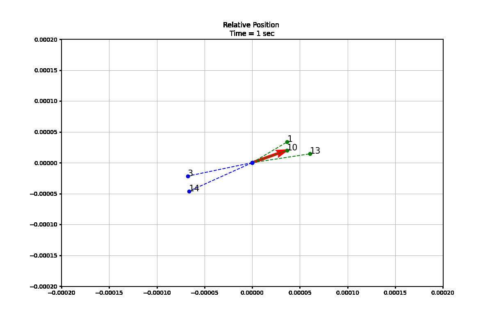

# Big Data Derby 2022 — Horse Racing Tracking Analysis

Analysis and visualization for the [Big Data Derby 2022](https://www.kaggle.com/competitions/big-data-derby-2022) Kaggle competition, using NYRA (New York Racing Association) GPS tracking data from Aqueduct, Belmont, and Saratoga. The goal was to mine per-stride positional data to find insights into racing strategy and horse welfare.

## Data

The competition provides ~5 Hz GPS tracking (`trakus`) for every horse in every race, alongside race and start tables. Each record is a horse's latitude/longitude at a point in time, which we convert to track-relative coordinates, cumulative distance, and inter-horse spacing.

## What's here

### `distance-analysis.ipynb`
The main analysis notebook:

- **Distance analysis** — relationship between total distance run and finishing position, broken down by course and race type, including how distance is allocated across race segments. Finding: higher placers tend to accelerate harder in the *second half* of the race relative to their peers.
- **Zone analysis** — a methodology for classifying each horse's position into directional zones and tracking zone changes over the race (most positional churn happens early).
- **Jockey vs. horse** — why naively attributing performance to the jockey doesn't work, and how to frame it properly.
- **Suggestions to jockeys** — actionable takeaways from the above.

### `relative-position-visualization.ipynb`
Builds the **animated relative-position view** (see GIF above): each horse's position relative to the field over the course of a race, derived from the trakus tracking table — angle/zone computation and a frame-by-frame `trakus_index` animation.

## Stack

`pandas` · `seaborn` · `matplotlib` (animation)

---
*Team submission; the relative-position visualization is my contribution. Originally developed on Kaggle ([tarratana](https://www.kaggle.com/tarratana)).*
