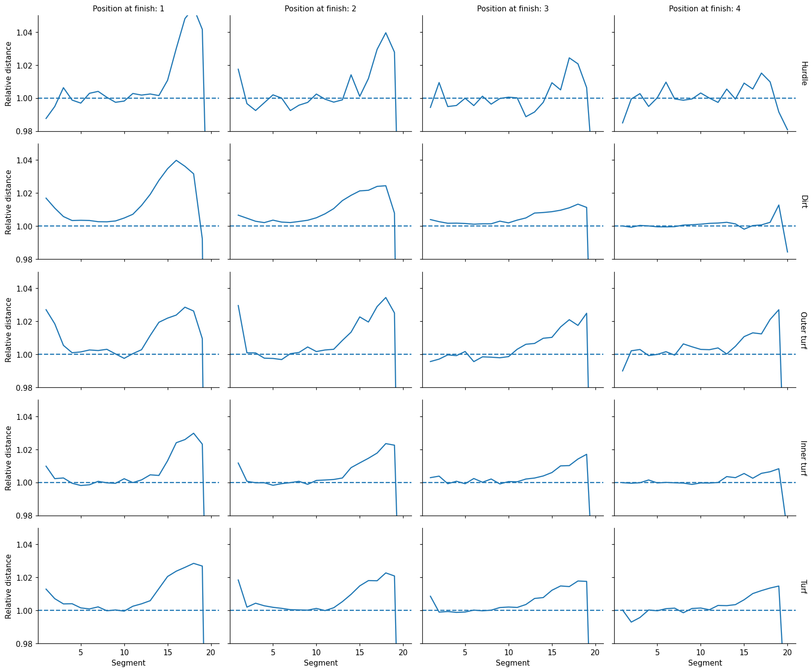
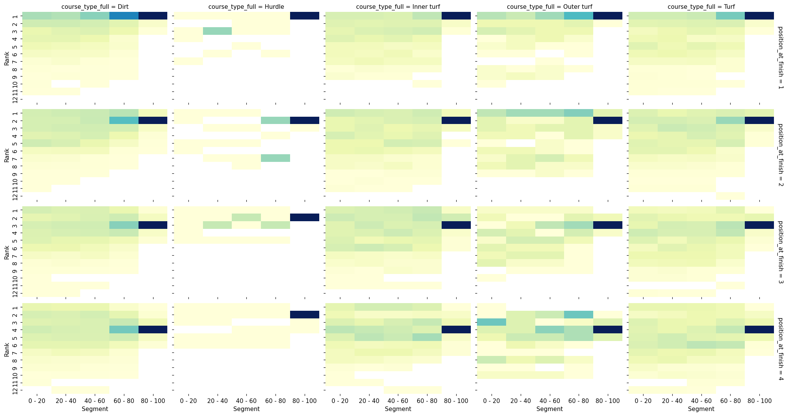
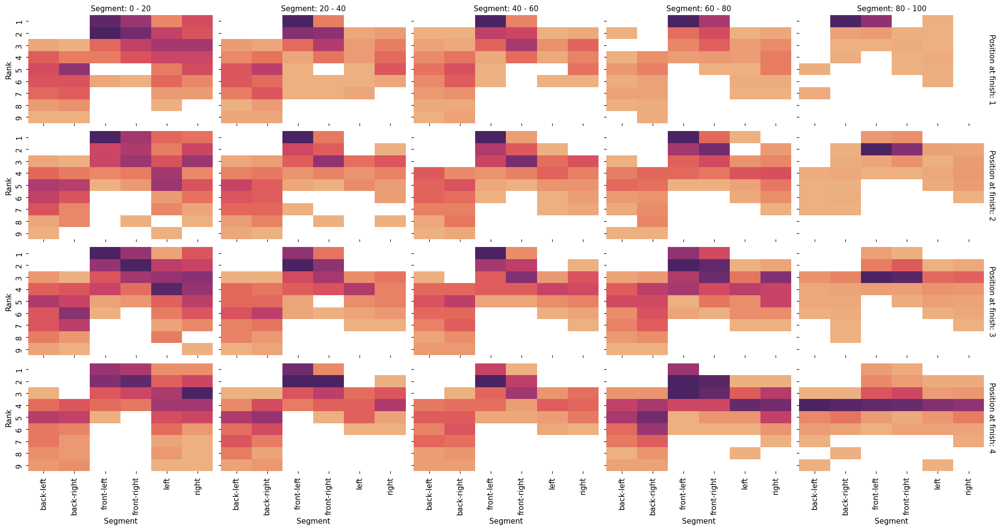

# Big Data Derby 2022 — Horse Racing Tracking Analysis

Team submission for the [Big Data Derby 2022](https://www.kaggle.com/competitions/big-data-derby-2022) Kaggle competition — an **Analytics** competition (no leaderboard; entries are judged as writeups). It uses NYRA (New York Racing Association) per-stride GPS tracking data from Aqueduct, Belmont, and Saratoga to find insights into racing strategy and horse welfare.

## Data

The competition provides ~5 Hz GPS tracking (`trakus`) for every horse in every race, plus race and start tables. Each record is a horse's latitude/longitude over time, converted to track-relative coordinates, cumulative distance, and inter-horse spacing. All notebooks here run on a consolidated master dataset, `tarratana/big-derby-master`, built for the team.

## Contents

### `final-writeup.ipynb` — the submitted analysis
The team's final competition writeup:

- **Problem statement** — what is the optimal strategy for a horse to run a race?
- **Distance analysis** — distance ran vs. finishing position, by course type and race type, including a per-segment breakdown. Finding: high placers tend to run *more* in the second half relative to their peers.
- **Ranking by segment** — how relative position evolves across the race under different track/race conditions.
- **Zone analysis** — classifying each horse's position into directional zones and tracking zone changes (most positional churn happens early).
- **Conclusion** — actionable takeaways on race strategy.

### `relative-position-visualization.ipynb`
An **animated relative-position view** (see GIF above): each horse's position relative to the field over the course of a race, derived from the trakus table — angle/zone computation and a frame-by-frame `trakus_index` animation. An exploratory component developed alongside the final writeup.

## Key findings

**Winners run more in the second half.** Splitting each race into segments and measuring distance relative to the field, the front of the field accelerates *away* in the back half — and higher finishers commit to it earlier. The effect holds across course types (rows) and is strongest for eventual 1st/2nd-place horses (columns).

**Finishing position is decided late.** This rank-by-segment heatmap shows where a horse's final placing gets locked in: the dark band concentrates in the **80–100% segment**, i.e. position is largely settled in the closing stretch rather than early.

**Winners hold the front zones the whole way.** Classifying each horse's position into directional zones (front-left, front-right, left, right, back-left, back-right) and tracking zone occupancy across segments: in Stakes races, eventual winners (top row) concentrate in the **front-left / front-right** zones from the opening segment onward, while the rest of the field is spread across the back and side zones.

> The full notebook renders all 15 figures inline (distance distributions, segment analysis, zone transitions and per-race-type zone overviews) — view [`final-writeup.ipynb`](final-writeup.ipynb).

## Contributors

- **Tanapat Ratana** — [tarratana](https://www.kaggle.com/tarratana)
- **Rungrawin Warunanont** — [rungrawinwarunanont](https://www.kaggle.com/rungrawinwarunanont)

## Stack

`pandas` · `seaborn` · `matplotlib` (animation)
